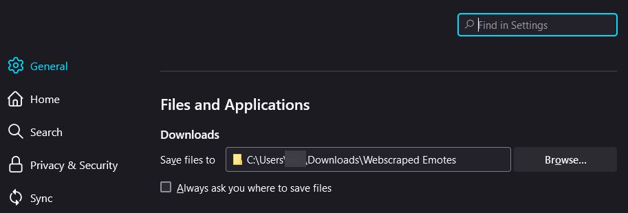
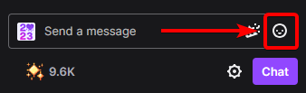
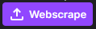
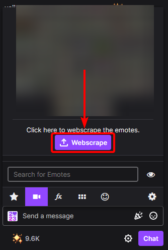
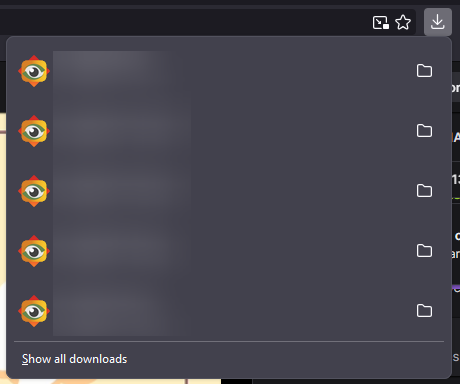
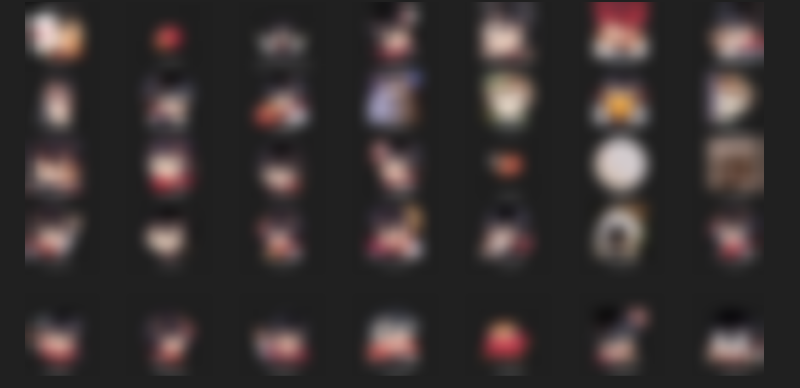

> [!CAUTION]
> Before webscraping, make sure to have the correct folder set for your emotes.
> 
> All the files will be downloaded to the default Downloads folder root!
> 

> [!IMPORTANT]
> If the streamer is :green_circle: **ONLINE**, please wait 3-5 seconds for  to get set.
> 
> If the streamer is :red_circle: **OFFLINE**, please wait 5-10 seconds for  to get set.

# **Tutorial**
## **Step #1:**
### Click 

## **Step #2:**
### Click 

## **Step #3:**
### Done! All the emotes has been downloaded to your harddrive.

## **Step #4:**
### The emotes webscraped here belongs to **me**, for copyright sake.

> [!IMPORTANT]
> It is **ILLEGAL** to webscrape emotes on twitch, I am not responsible for anything that happens.